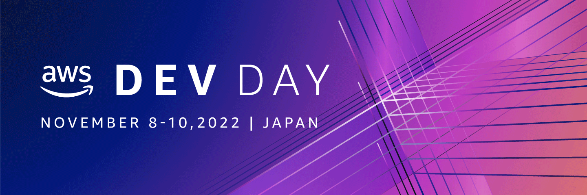

# AWS Dev Day Online Japan 2022 Call for Proposals

  

AWS が開催する開発者のための技術の祭典「AWS Dev Day 2022 Japan」では幅広く開発者の皆様から発表していただく「Call for Proposal」をプログラムに取り入れています。 みなさまが培われたご経験、知見、そしてノウハウをぜひこの場で共有していただけませんか？ ご応募をご検討いただける場合は下記募集要項をご確認いただき、[応募フォーム](https://github.com/aws-events/aws-dev-day-online-japan-2022-cfp/issues/new/choose )にセッション情報を入力してください。また、ご応募された方のご連絡先などの情報を別フォームにご記入いただきます。ご応募いただいたのち、選考を経て採否を決定させていただきます。予めご了承ください。

:pencil: [セッション応募フォームはこちら](https://github.com/aws-events/aws-dev-day-online-japan-2022-cfp/issues/new/choose)

:rocket: [現在の応募済みセッション一覧はこちら](https://github.com/aws-events/aws-dev-day-online-japan-2022-cfp/issues)

### 応募条件

1. アプリケーション開発の一般的なトピックもしくはAWS を活用した開発に関するトピックであること
2. AWS Dev Day 2022 Japan 会期中 (2022年 11 月 8 日 ~ 10 日) のいずれの日程および時間帯 (13:00 ～ 19:00)でもプレゼンテーションできること（可能なかぎり会場（ベルサール渋谷ガーデン（東京都渋谷区）でのプレゼンテーションをお願いしています）。もしくは事前収録できること。
3. 下記に定義したトピックや技術カテゴリのいずれかに、開発者の視点から関係していること (複数にまたがっていても問題ありません)
  - トピック
    - Web フロントエンド開発
    - Web バックエンド / サーバーサイド開発
    - モバイル / ネイティブアプリケーション開発
    - DevOps / Infrastructure as Code
    - プログラミング
    - アプリケーションアーキテクチャー
    - ソフトウェアテスト
    - エンジニアリングプロセス
    - エンジニアのキャリア
    - エンジニア組織のカルチャー
  - 技術カテゴリ
    - サーバーレス
    - コンテナ
    - フロントエンド
    - AI / 機械学習
    - データベース
    - アナリティクス
    - IoT
    - Web3/ブロックチェーン
4. 有効とみなされたご応募について、**セッションタイトル、アブストラクト、などの応募内容が GitHub 上で公開され、SNS を介してシェアされることに同意していただけること**
5. メールを利用した事務局とのコミュニケーションが可能であること
6. プレゼンテーションの後でAsk the Speakerに参加していただけること
7. セッション資料を事前(10月24日まで）に提出していただけること
8. セッション資料の会期後の公開（投影用と多少異なっていてもかまいません）、動画の公開に同意していただけること
9. 当ページのフォームを使用し応募登録を完了していること。また、同様に[イベント登録規約](https://aws.amazon.com/events/terms/)、および [AWS 行動規範 Code of Conduct](https://aws.amazon.com/codesofconduct/) に同意していること

### セッション時間
下記よりお選びください(応募フォームで選択いただきます)
- 20分
- 45分

### 応募締切

2022 年 8月 21 日（日）23:59 JST

### 選考方法

1. AWS Dev Day Online Japanコアメンバーによる審査
2. **GitHubへのリアクション数**

1, 2 を総合的に判断し、採否を決定いたします

### 選考結果のお知らせ

2022年 8 月 26日（金）前後を予定しております。  
選考結果につき、セッション応募時にご入力いただいたメールアドレス宛にご連絡します。

### 過去のAWS Dev Day Online CFP採択セッションの例 (AWS Dev Day Online Japan 2020)

[こちらから2021年開催の同様のイベントでのCFP採択セッション](https://aws.amazon.com/jp/about-aws/events/2021/devday/)をご覧いただくことができます。ぜひご活用ください

また、[こちらからAWS Dev Day Online Japan (2021)のもようをダイジェスト](https://youtu.be/EeBQWTV4skM)でご覧いただくことができます。

:pencil: [セッション応募フォームはこちら](https://github.com/aws-events/aws-dev-day-online-japan-2021-cfp/issues/new)

:rocket: [現在の応募済みセッション一覧はこちら](https://github.com/aws-events/aws-dev-day-online-japan-2021-cfp/issues)

皆様のご応募を心よりお待ちしております

## AWS Dev Day Online Japan とは

AWS Dev Day Online Japanは、AWSがご提供する新たな時代をリードする開発者の皆様のための、年に一度の技術の祭典です。今押さえておくべき技術領域を幅広く網羅したテクニカルセッション、実践的な経験事例セッションなどを原則としてライブでお届けします。2021年は特に「ライブ」にこだわり、ライブコーディング、ライブデモ、そしてライブ Q&A を多数備え、参加者の皆様ともっとつながることができたらと考えています。ぜひ、ご期待ください。

* 開催日程：2022年11月08日（火）～ 10日（木）（3日間）
* 開催形態：オンライン および一部 オフライン
* イベント構成：ゼネラルセッション、ブレイクアウトセッション、スペシャルセッション、ワークショップ etc
* 参加対象：アプリケーション開発、ソフトウェア開発に携わる開発者、エンジニアの皆様
